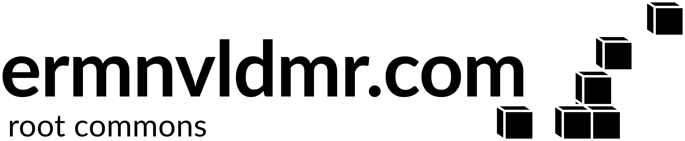

  

# [ermnvldmr.com-root-commons](https://github.com/deytenit/ermnvldmr.com-root-commons)

The engine powering the shared infrastructure of `root.ermnvldmr.com`. This repository contains the generic logic, scripts, and deployment patterns used across multiple unrelated self-hosted applications.

## Quick Start

- Visit the documentation: <https://docs.ermnvldmr.com/root/concepts/operator-commons>
- Report an issue: <https://github.com/deytenit/ermnvldmr.com-root-commons/issues>
- View available actions: `root --help`
- Infrastructure principles: [Principles Guide](https://docs.ermnvldmr.com/root/concepts/infrastructure-principles)

## Essential Information

You should learn the following, before exploring the project:

### License

MIT (see [Copyright & License](#copyright--license))

### Repository Structure

#### Core Logic

- **[scripts/run/root](./scripts/run/root)**: Unified entrypoint wrapper for all infrastructure actions.
- **[scripts/actions](./scripts/actions)**: Grouped automation tasks (configure, sync, tiers, utils).
- **[scripts/lib](./scripts/lib)**: Reusable Bash libraries for environment setup, validation, and templating.

#### Assets & Tools

- **[githooks](./githooks)**: Shared Git hooks for maintaining repository integrity.
- **[source](./source)**: Independent tools and generators (e.g., `happ-subscription-generator`).
- **[etc](./etc)**: Generic configuration templates and baseline dotfiles.

## Who Are You?

### Operator

Managing or deploying nodes within the ecosystem.

- **Setup**: Run `./init.sh` in the main repository to link the commons.
- **Usage**: Use the `root` command to manage your host:
  - `root configure base <node>`
  - `root configure ufw <node>`
  - `root sync repository <node>`
- **Guides**: Follow the [Setting Up Your First Node](https://docs.ermnvldmr.com/root/guides/first-node) guide.

### Developer

Want to add new actions or improve the engine logic.

- **Environment**: Scripts assume a "warm" environment provided by the `root` wrapper.
- **Adding Actions**: Create a new script in `scripts/actions/{group}/` and implement `action_metadata()`.
- **Testing**: Test changes locally or on a staging node before pushing to `main`.
- **Code Quality**: Ensure scripts are idempotent and follow the [common.sh](./scripts/lib/common.sh) logging standards.

### Contributor

Want to submit improvements.

- **Workflow**: Fork, branch from `main`, submit pull request.
- **Code Standards**: Scripts must be shell-agnostic (POSIX-friendly Bash) and include metadata for the help system.
- **CI Requirements**: Ensure `root utils lint-docker-compose` passes if modifying compose templates.

## Communication & Support

- **Issues**: <https://github.com/deytenit/ermnvldmr.com-root-commons/issues>
- **Email**: <personal@ermnvldmr.com>

## Copyright & License

**Source Code**: Licensed under the [MIT license](./LICENSE).

---

**AI Assistance**:
Significant portions of this project's _source code_ were developed with
the assistance of AI code generation tools.
_(Manually writing all those scripts would be tedious)_

Copyright © 2026 Vladimir Eremin
